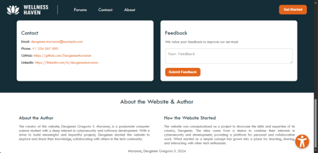
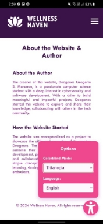

# HCI Finals Website

This is a website showcasing key Human-Computer Interaction (HCI) concepts. The website features interactive examples and resources related to HCI principles.

## How to Open the Website

There are two options to access the website:

1. **Hosted Version**:  
   You can open the website directly by visiting:  
   [https://hci-dxo.400badrequest.xyz/](https://hci-dxo.400badrequest.xyz/) or [https://hci-finals.vercel.app/](https://hci-finals.vercel.app/)

2. **Local Version**:  
   - Clone this repository:
     ```bash
     git clone https://github.com/DeogenesMaranan/HCI_Finals
     ```
   - Navigate to the project folder and open `index.html` in your browser.
  
---
## Screenshots




### Button Tooltips


### Colorblind Modes


### Translation


### Responsiveness

<div style="display: flex; flex-wrap: wrap; gap: 10px;">
  
  
  
  
  
  
</div>

---

## Developer

- **Name**: Maranan, Deogenes Gregorio S.  
- **SR Code**: 22-07432  
- **Section**: CS 3102  
